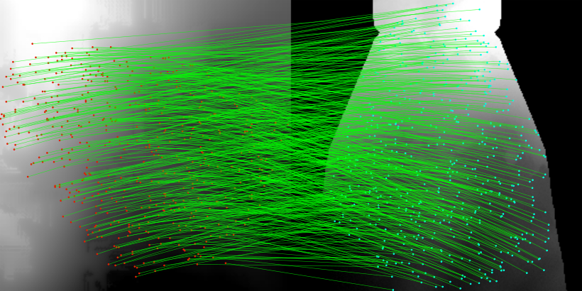
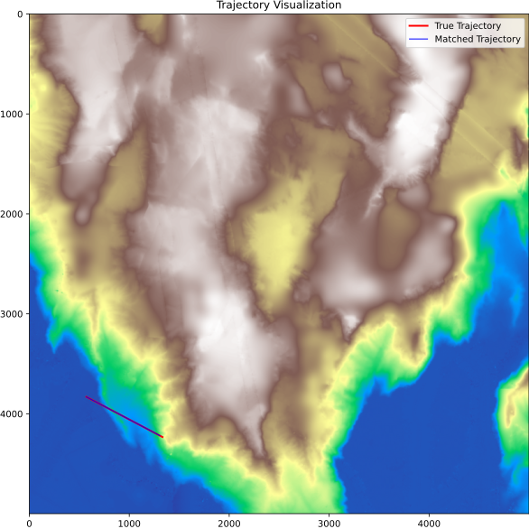

# 地形重力匹配器（Terrain Gravity Matcher, TGM） 🚀

---

## 项目简介


本项目旨在研究**地形图像匹配**在定位任务中的应用。模型通过**地形参考图（DEM 生成的影像）**与**模拟多波束声呐条带**进行训练，能够在真实多波束测量中常见的噪声和缺失数据条件下实现鲁棒匹配。

目前，项目已支持**地形场图像匹配**，并通过**模拟多波束轨迹定位实验**进行了验证。

> ⚙️ 网络骨干基于 [RoMa](https://github.com/Parskatt/RoMa) 进行改进，并针对物理场匹配进行专项调整。

---


## 👀 可视化结果

### 匹配结果展示

<p align="center">
  
  
</p>

---

### 仿真结果展示

<p align="center">
  
  
</p>

---


## ✨ 主要特性

- 🤖 基于深度学习的地形图像匹配方法
- 🌊 支持模拟多波束声呐条带训练
- 🛡️ 对噪声与缺失区域具有鲁棒性
- 🗺️ 端到端的轨迹定位仿真流程
- 🧩 CNN 编码器与 GP 匹配主干网络结合

---


## 🛠️ 环境配置


### 1. 创建 Conda 环境 🐍

```bash
conda create -n TGM python=3.12
conda activate TGM
```


### 2. 安装依赖 📦

首先安装所需 Python 包：

```bash
pip install -r requirements.txt
```

然后以可编辑模式安装本项目：

```bash
pip install -e .
```


### 3. 预训练权重（必需） 🔑

首次使用时，请下载以下编码器的预训练权重：

- **VGG19**：作为主干编码器，若本地存在权重将自动加载。
- **RepVGG**：
	- 代码仓库：[RepVGG](https://github.com/DingXiaoH/RepVGG)
	- 官方权重下载：[百度网盘链接](https://pan.baidu.com/share/init?surl=9YwKCTSPVgJu5Ueg0Q78-w&pwd=rvgg)

请将权重文件放置于代码指定目录下。

---


## 🏋️‍♂️ 训练与评估


### 1. 训练模型 🔬

在项目根目录下运行：

```bash
python3 ./TGMatcher/train/train_tgm.py # use 'python' on windows platforms
```

训练前请准备好模拟多波束条带与地形参考影像数据。


### 2. 模型评估 📊

在测试集上评估已训练模型：

```bash
python3 ./TGMatcher/train/evaluate_tgm.py
```

脚本将输出匹配精度及相关指标。

---


## 🧭 轨迹定位仿真

多波束定位仿真代码位于：

```
./Experiment/localization
```

步骤如下：
1. 修改仿真参数：
	- `./Experiment/localization/sim_config.yaml`
2. 运行仿真：
	- `python3 ./Experiment/localization/sim_eval.py`

仿真将生成轨迹并基于地形匹配结果评估定位性能。

---


## 📁 项目结构（简要）

```
TGMatcher/
├── model/                # 网络结构相关代码
│   ├── encoder.py        # 编码器实现
│   ├── matcher.py        # 匹配器实现
│   ├── model.py          # 主模型结构
│   ├── RepVGG/           # RepVGG 相关模块
│   └── Transformer/      # Transformer 相关模块
├── train/
│   ├── train_tgm.py      # 训练脚本
│   └── evaluate_tgm.py   # 评估脚本
Experiment/
├── localization/
│   ├── sim_eval.py       # 仿真主程序
│   └── sim_config.yaml   # 仿真参数配置
```

---


## 📌 说明与声明

- 当前实现聚焦于地形场匹配，框架可扩展至其他地理参考匹配任务。
- 预训练网络设计支持旋转鲁棒性。
- 网络骨干基于 [RoMa](https://github.com/Parskatt/RoMa) 改进，具体结构详见 `TGMatcher/model/` 文件夹。
- 本项目仅供学术与科研用途。
- 预训练模型（RepVGG）请遵循原仓库的授权协议。

---


## 🙏 致谢

本项目在实现过程中参考并使用了以下开源项目的代码：

- RoMa: Robust Dense Feature Matching  
  https://github.com/Parskatt/RoMa  
  License: MIT

- RepVGG: Making VGG-style ConvNets Great Again  
  https://github.com/DingXiaoH/RepVGG  
  License: MIT

---


## 📬 联系方式

如有仿真或训练流程相关问题，欢迎提交 issue 或联系作者。


